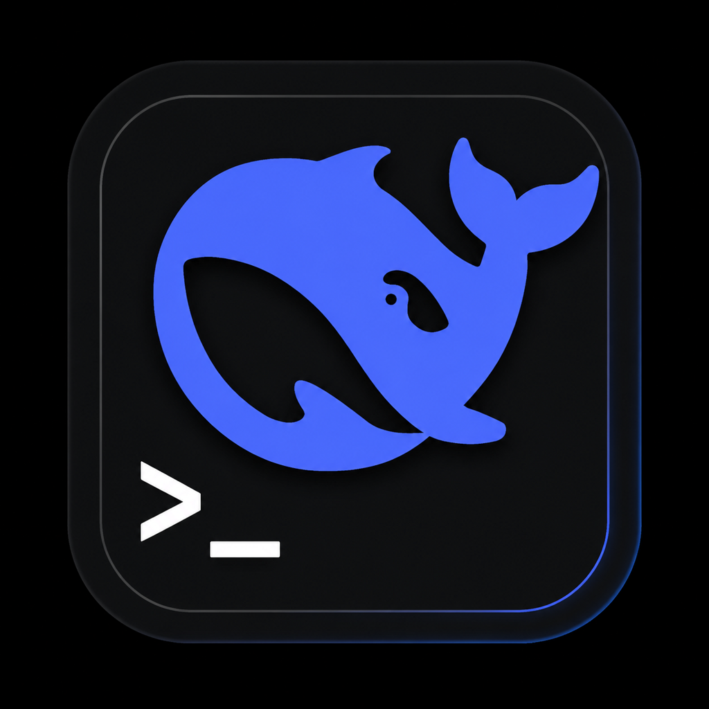

<p align="center">
  
</p>

<h1 align="center">DSH Agent</h1>

<p align="center">
  DeepSeek Harness 桌面客户端 — 一键启动 <code>dsh web</code>，自动准备运行环境，在原生窗口中直接使用。
</p>

<p align="center">
  <a href="https://github.com/makise2060/dsh-agent/releases"></a>
  <a href="https://v2.tauri.app"></a>
  <a href="https://svelte.dev"></a>
  <a href="https://www.rust-lang.org"></a>
  <a href="https://tailwindcss.com"></a>
  <a href="#license"></a>
</p>

## 概述

DSH Agent 将 DeepSeek Harness 的 Web UI 包装为一个**独立桌面应用**：首次启动自动完成 Node.js 检测/下载、dsh 安装、界面插件安装，之后双击图标即可使用——无需打开终端、输入 `dsh web`、再手动在浏览器中访问 URL。

### 核心功能

| 功能 | 说明 |
|------|------|
| **首次启动引导** | 9 阶段流水线：检测/下载 Node.js（版本闸门 `^22.19.0 \|\| >=24.0.0`）→ 安装 dsh → 安装界面插件 → 启动服务；全程进度展示，二次启动毫秒级通过 |
| **便携 Node.js** | 系统 Node 缺失或版本不符时自动下载便携版（镜像测速排序 + SHA256 官方独立校验 + 断点续传），不动系统环境 |
| **界面插件全家桶** | 一键安装 `dsh-web-ui-all`（鲸鱼娘 / 任务看板 / 皮肤中心 / 右侧面板），装完自检挂载，可随时修复/重装 |
| **任务完成通知** | 任务完成时系统通知 + 托盘/任务栏闪烁（仅窗口不在前台时打扰），可在关于页开关 |
| **托盘常驻** | 关闭窗口驻留托盘，dsh 后台继续运行；关闭行为三选（退出/托盘/取消）可记忆 |
| **主题联动** | 导航栏三态主题（浅色/深色/跟随系统）与 dsh 外观配置双向同步 |
| **插件市场** | GitHub Search API 搜索 `topic:dsh-plugin` 仓库，安装 / 移除 / 激活插件 |
| **环境自检** | 检测 Node.js / npm / dsh / `DSH_HOME`，需处理项高亮提示 |
| **版本更新** | dsh 与应用自身均可检查更新（npm registry + GitHub Releases） |
| **日志系统** | 崩溃 / node 异常 / 连接错误写入安装目录日志，关于页一键打开 |
| **进程清理** | Job Object + 关窗清理，dsh 进程树不残留 |

## 技术栈

| 层 | 技术 | 说明 |
|---|---|---|
| 桌面框架 | **Tauri 2.x** | Rust 后端 + 系统 WebView2 |
| 前端框架 | **SvelteKit 2.x** (静态 SPA) | 编译为纯静态文件，由 Tauri 内嵌加载 |
| UI 框架 | **Tailwind CSS 3.x** | 原子化 CSS |
| 后端 | **Rust** (edition 2021) | tokio async runtime，进程管理 + HTTP 请求 |
| 包管理 | **pnpm** + **Cargo** | 前端依赖用 pnpm，Rust 依赖用 Cargo |

## 快速开始

### 前置要求

| 工具 | 最低版本 | 说明 |
|------|---------|------|
| [Node.js](https://nodejs.org/) | ≥ 22.19 或 ≥ 24 | dsh 本身依赖 Node.js 运行时；缺失或版本不符时应用会自动下载便携版 |
| [pnpm](https://pnpm.io/) | ≥ 9 | 前端包管理器 |
| [Rust](https://www.rust-lang.org/) | ≥ 1.75 | Tauri 后端编译 |
| [dsh](https://www.npmjs.com/package/@deepseek-ai/dsh) | latest | 未安装时应用会自动安装 |

> **Windows 用户**：需安装 [WebView2 Runtime](https://developer.microsoft.com/microsoft-edge/webview2/)（Win11 已内置）。

### 安装依赖

```bash
# 前端依赖
pnpm install

# Rust 依赖会在首次构建时自动拉取
```

### 开发模式

```bash
pnpm tauri dev
```

启动后：
1. Vite dev server 在 `http://localhost:5173` 运行
2. Cargo 编译 Rust 后端（首次约 5-8 分钟）
3. Tauri 窗口弹出，WebView 加载前端
4. 前端调用 `start_bootstrap` 命令，Rust 后端走 9 阶段引导流水线
5. 从 stdout 解析端口后，iframe 加载 `http://127.0.0.1:{port}`

### 生产构建

```bash
pnpm tauri build
```

生成物位于 `src-tauri/target/release/bundle/`。Windows 安装包由 Inno Setup 编译为 `DSH-Agent_{version}_x64-setup.exe`。

## 界面说明

应用顶部导航栏提供四个功能页签（图标化，激活时展开文字）：

### 主界面

启动 `dsh web` 并在 iframe 中加载。右上角状态指示器显示当前进程状态（图标 + 颜色 pill）。

| 状态 | 含义 |
|------|------|
| 未启动 | dsh 进程尚未启动 |
| 启动中 | 正在 spawn 进程并等待端口输出 |
| 运行中 | dsh web 已在运行，iframe 已加载 |
| 停止中 | 正在终止进程树 |
| 已停止 | 进程已终止 |
| 错误 | 启动失败（超时 / dsh 未安装等） |

### 运行环境

检测并展示：
- **Node.js** — 版本号、安装路径、是否满足 ≥22.19 要求
- **npm** — 版本号、安装路径
- **dsh** — 版本号、安装路径
- **dsh 更新** — 独立卡片：检查更新 / 一键安装 / 更新到最新，安装日志可折叠
- **DSH_HOME** — 目录是否存在、`profiles/` 和 `sessions/` 子目录状态

需处理项（Node 未装 / 版本不足 / dsh 未装或有更新）会以红/橙描边高亮。

### 插件市场

- **界面插件全家桶**卡片：状态检测（未安装/已安装/需修复）+ 一键安装 / 重装 / 修复安装 / 自检
- 调用 GitHub Search API 搜索 `topic:dsh-plugin` 仓库，支持排序与关键词搜索
- 每个仓库卡片显示：名称、描述、Star 数、最近更新时间、License
- 安装通过 `dsh plugin --profile web add <package>` 执行，stdout 实时流式显示

### 关于

- 应用版本、GitHub 链接、问题反馈
- **检查更新**：查询 GitHub Releases，发现新版本自动打开下载页
- **查看日志**：一键打开日志目录
- **任务完成通知**开关

## Rust 后端命令

所有前端 → 后端调用通过 Tauri IPC (`invoke`)：

| 命令 | 参数 | 返回值 | 说明 |
|------|------|--------|------|
| `start_bootstrap` | — | `()` | 9 阶段引导流水线（Node/dsh/插件/启动） |
| `start_dsh` | — | `ProcessState` | spawn `dsh web --port 0`，解析 stdout 获取端口 |
| `stop_dsh` | — | `()` | 终止 dsh 进程树 |
| `get_dsh_status` | — | `ProcessState` | 查询当前进程状态 |
| `restart_dsh` | — | `ProcessState` | 先 stop 再 start |
| `check_environment` | — | `EnvState` | 检测 Node/npm/dsh/DSH_HOME |
| `install_dsh` | — | `()` | `npm install -g @deepseek-ai/dsh@latest`（镜像降级） |
| `check_dsh_update` | — | `UpdateInfo` | 查 npm registry 比较版本 |
| `check_app_update` | — | `UpdateInfo` | 应用自身版本检查（GitHub Releases） |
| `check_bundle_status` | — | `BundleStatus` | 界面插件全家桶状态检测 |
| `install_bundle` | — | `BundleStatus` | 安装/修复全家桶（registry 降级 + 构建白名单重试） |
| `verify_bundle` | — | `BundleStatus` | 全家桶挂载自检 |
| `search_plugins` | `query?, sort?, page?` | `PluginSearchResult` | GitHub API 搜索 |
| `list_installed_plugins` | — | `InstalledPlugin[]` | 列出已安装插件 |
| `install_plugin` | `packageName` | `()` | `dsh plugin add` |
| `remove_plugin` | `packageName` | `()` | `dsh plugin remove` |
| `activate_plugin` | `pluginId, pluginName` | `()` | 编辑 `cordis.patch.yml` |
| `get_theme_preference` | — | `String` | 读 dsh 外观偏好（light/dark/system） |
| `set_theme_preference` | `preference` | `String` | 写 dsh 外观偏好 |
| `get_notify_on_done` | — | `Boolean` | 任务完成通知开关（读） |
| `set_notify_on_done` | `enabled` | `()` | 任务完成通知开关（写） |
| `get_logs_dir` | — | `String` | 日志目录路径 |

### 事件

| 事件名 | Payload | 说明 |
|--------|---------|------|
| `process-state-changed` | `ProcessState` | 进程状态变更通知 |
| `bootstrap:progress` | `BootstrapProgress` | 引导流水线进度（阶段/详情/百分比） |
| `bootstrap:ready` / `bootstrap:failed` / `bootstrap:warning` | — | 引导结果与警告 |
| `dsh-stdout` | `String` | dsh stdout 逐行输出 |
| `install-progress` | `{ stage, message, percent? }` | dsh 安装进度 |
| `plugin-install-progress` | `{ package, stage, message, percent? }` | 插件/全家桶安装进度 |
| `close-requested` | — | 关闭确认请求（触发三选弹窗） |

## 配置

### Tauri 配置 (`src-tauri/tauri.conf.json`)

关键配置项：
- **窗口**：1280×800，最小 900×600，可调整大小
- **CSP**：允许 `127.0.0.1:*` 的 connect/frame（dsh web）、`api.github.com`（插件搜索）、`registry.npmjs.org`（版本检查）、`avatars.githubusercontent.com`（头像图片）
- **WebView2**：缺失时自动下载 Bootstrapper 安装

### DSH_HOME

dsh 的配置目录，默认为 `~/.dsh/`，可通过环境变量 `DSH_HOME` 自定义：

```
~/.dsh/
├── profiles/
│   └── web/
│       ├── package.json      # 插件依赖
│       ├── node_modules/     # 已安装插件
│       └── cordis.patch.yml   # 插件激活配置
└── sessions/                 # 会话数据
```

## 关于

<table>
  <tr>
    <td width="120" align="center">
      
    </td>
    <td>
      <h3>DrPepper (<a href="https://github.com/makise2060">@makise2060</a>)</h3>
      <p>后端攻城狮 · With the assistance of Dsh</p>
      <p>Makise(Sometimes) — an ordinary backend engineer navigating the AI tide. Optimistic, rational, and full of hope, building wonders in everyday life.</p>
      <p>
        <a href="https://github.com/makise2060"></a>
      </p>
    </td>
  </tr>
</table>

## 致谢

本项目的诞生离不开 [Linux.do](https://linux.do/) 社区的启发。感谢社区中分享 DeepSeek Harness 使用经验、推荐 Tauri 方案、讨论进程管理细节的各位大佬——是你们的真诚、友善、团结、专业让开源社区充满活力。

## License

MIT
